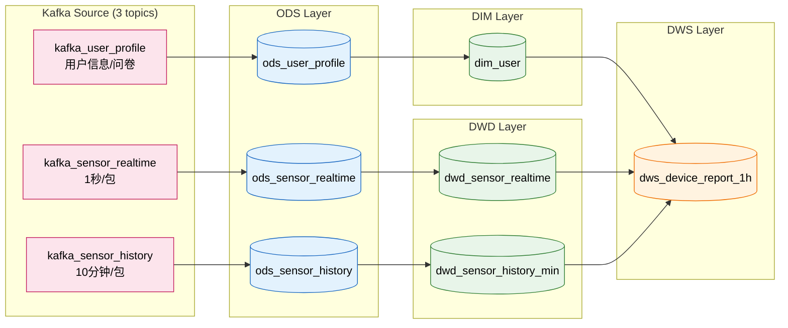

# 硬件传感器实时链路 — 表结构说明

**架构：Kafka → ODS → DWD → DWS（全流式）**

## 数据上传模式

| 模式 | 频率 | 内容 | Kafka Topic |
|------|------|------|-------------|
| 实时监测模式 | 1秒/包 | 秒级高优先级数据（蓝牙持续连接） | `kafka_sensor_realtime` |
| 历史同步模式 | 10分钟/包 | 原始信号 + 分钟级数据（蓝牙重连后批量） | `kafka_sensor_history` |

---

## Kafka Source（3 个临时源表）

1. `kafka_user_profile` — APP上报用户信息/问卷（维度数据）
2. `kafka_sensor_realtime` — 实时秒级包（心率、计步、佩戴、体动、姿态）
3. `kafka_sensor_history` — 历史10分钟包（PPG/IMU原始信号、分钟级指标）

---

## DIM 层（维度层 — 1 张 Paimon 表）

| 表名 | 说明 | 主键 | 来源 |
|------|------|------|------|
| `dim_user` | 用户维度（BMI、失眠/抑郁/焦虑等级、时型） | device_id | ods_user_profile |

---

## ODS 层（原始数据层 — 3 张 Paimon 表）

| 表名 | 说明 | 主键 | 来源 |
|------|------|------|------|
| `ods_user_profile` | 用户信息/问卷原始数据 | device_id | kafka_user_profile |
| `ods_sensor_realtime` | 实时秒级快照（心率/计步/佩戴/体动/姿态） | device_id, event_ts | realtime |
| `ods_sensor_history` | 历史10分钟包（原始信号+分钟级指标，JSON payload） | device_id, ts_start | history |

---

## DWD 层（明细层 — 2 张 Paimon 表）

| 表名 | 说明 | 主键 |
|------|------|------|
| `dwd_sensor_realtime` | 实时秒级明细，含心率区间、运动负荷标签、佩戴状态 | device_id, event_ts |
| `dwd_sensor_history_min` | 历史分钟级宽表（从history包展开），含活动强度、HRV质量标签 | device_id, ts_start |

---

## DWS 层（汇总层 — 1 张 Paimon 表）

| 表名 | 说明 | 主键 |
|------|------|------|
| `dws_device_report_1h` | 设备每小时综合报告（实时+历史融合聚合） | device_id, ds, hh |

**总计 7 张 Paimon 持久化表**

---

## 数据流图

