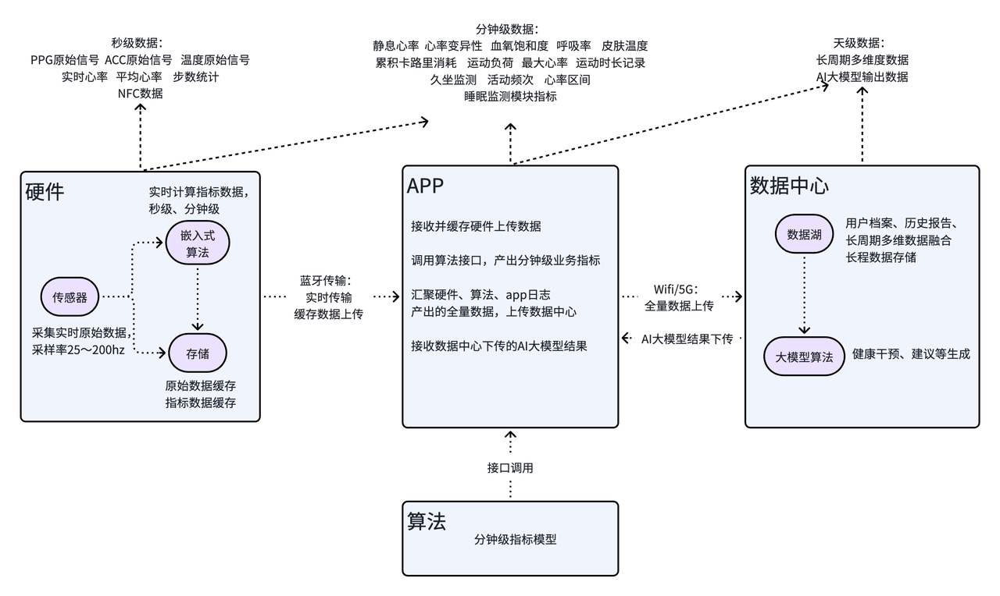

[ AI智能手环调研和开发计划 > 数据链路图](https://xyer6aogm6.feishu.cn/docx/AKg7dJ6z2oHK2Yxuab2cAw0dnze?openbrd=1\&doc_app_id=501\&blockId=OebLdMdU8oS5gXxaH9WcrSAJnTM\&blockType=whiteboard\&blockToken=PRYkwk61PhGNy6bajJmc23h2nWc#OebLdMdU8oS5gXxaH9WcrSAJnTM)

# 硬件产生什么数据

* 传感器采集: 实时原始生理&运动信号

PPG光电容积脉搏波信号：采样率25hz～200hz；睡眠场景低采样，运动场景高采样

六轴IMU（加速度计+陀螺仪）：采样率 10Hz～50Hz，用于体动、姿态、步数、站立 / 坐 / 躺姿势识别；陀螺仪辅助运动姿态解算，提升动态场景下的角度稳定性。

温度：0.0167hz～1hz（1 次 / 分钟～1 次 / 秒）；日常低频，监测时提高频率。

NFC，用于设备配对、身份校验、快速交互，不产生时序采样数据。

生物电阻抗：0.1Hz～1Hz；主要用于佩戴状态检测。后续可做体脂率、身体成分分析。

* 嵌入式算法

输入PPG原始信号->

秒级计算：实时预处理算法 -> 实时滤波算法 （基线漂移去除、运动噪声抑制、滤波）->

&#x20;    实时心率提取算法 (脉搏波峰值检测、心率计算) ->

分钟级计算：心率变异性、血氧饱和度、呼吸率

输入IMU原始信号->

秒级计算：体动强度计算 -> 坐、卧、站状态判断 -> 计步

输入温度原始信号->

秒级计算：采样值转换成皮肤温度 -> 平滑滤波 -> 异常值剔除

~~分钟级计算：均值、最大值、最小值~~

生物电阻抗信号->

秒级计算: 判断佩戴 / 未佩戴状态 (未佩戴时自动关闭 高功耗传感器)

# 数据优先级

1. 实时监测模式

APP打开“实时监测页面”时启动，硬件与APP通过蓝牙持续连接，实时传输数据，APP同步展示实时指标。

数据涉及规则类计算，适合放在app，其余由硬件上传

* 历史数据同步模式

App未打开实时监测模式，蓝牙未连接，App未发起数据同步请求，硬件本地缓存数据

当蓝牙连接，App发起数据同步请求后，批量上传缓存的历史数据，并完成业务指标计算展示

业务指标24小时刷新一次，数据涉及规则、统计类计算适合放在app，其余调用算法服务器计算

实时监测模式下，蓝牙连接后，实时传输、计算高优先级数据

历史数据同步模式下，蓝牙连接后，批量传输硬件的低优先级数据，计算低优先级数据

|              | 硬件                                                                                                                                                                                                                  | app（app直接计算或调用算法计算）                                                                                                                                                                                                       | 算法                                             |
| ------------ | ------------------------------------------------------------------------------------------------------------------------------------------------------------------------------------------------------------------- | ------------------------------------------------------------------------------------------------------------------------------------------------------------------------------------------------------------------------- | ---------------------------------------------- |
| 高优先级数据  | 心率（秒级） 平均心率（秒级） 心率变异性（分钟级） 血氧饱和度（分钟级） 呼吸率（分钟级） 皮肤温度（分钟级） 计步（秒级） 佩戴检测（秒级） 坐、卧、站状态判断（秒级） 体动强度（秒级）                                                                        | 累计卡路里（秒级） 运动负荷（秒级） 运动时长（秒级） 心率区间（秒级） 最大心率（秒级）                                                                                                                                                    |                                                |
| 低优先级数据  | PPG原始信号 PPG预处理后信号 IMU原始信号 生物电阻抗原始数据 原始温度数据 滤波后温度数据 心率（分钟级） 心率变异性（分钟级） 血氧饱和度（分钟级） 呼吸率（分钟级） 皮肤温度（分钟级） 计步（分钟级） 佩戴检测（秒级） 坐、卧、站状态判断（分钟级） 体动强度（分钟级） | 平均心率（全天平均） 静息心率（全天平均） 心率变异性（全天平均） 血氧饱和度（全天平均） 呼吸率（全天平均） 皮肤温度（全天平均） 步数统计（全天） 久坐监测（全天） 活动频次（全天） 心率区间（全天） 最大心率（全天） 睡眠效率（全天） 睡眠时长（全天） 睡眠质量（平均） 睡眠压力（平均） | 入睡/起床判断 睡眠4周期分期 睡眠压力 睡眠质量  |

# 硬件数据原型&上传策略&缓存策略

数据采用JSON格式传输

1. 实时监测模式

蓝牙持续连接，1秒/包实时传输，仅包含硬件嵌入式秒级计算的高优先级数据，供APP直接解析展示或完成秒级计算

* 历史数据同步模式

APP主动发起同步、建立蓝牙连接后，10分钟/包批量传输，包含硬件采集的原始信号、嵌入式分钟级计算数据（低优先级），供APP计算天级指标、算法服务器计算睡眠相关指标

* 缓存策略：

缓存容量与周期：结合手环7天续航设计，支持本地缓存7天全量数据（按10分钟/包），超出7天自动按时间序覆盖最早数据，避免存储溢出。

缓存分片规则：按“1分钟”为最小缓存单元，所有数据（原始信号、算法输出指标）均按分钟分片存储，10分钟合并为1个传输包，便于蓝牙批量同步和断点续传。

# APP端数据整合逻辑

1. 实时监测模式

接收校验硬件数据 -> 完成解析 -> 本地规则阈值计算 -> 数据展示与缓存 -> 结束实时监测，全部数据上传数据中心

* 历史数据同步模式

接收校验硬件数据 -> 数据解析和数据关联、封装算法接口所需数据 -> 本地计算 -> 接收算法接口返回数据 -> 数据整合、展示与缓存 -> 同步完成，全部数据上传数据中心

# 算法端返回数据原型
