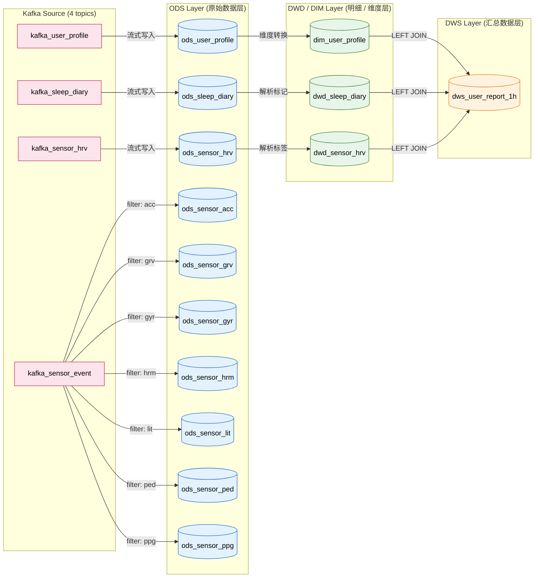

**全流式架构（All-Streaming）— 4 个 Kafka Topic → ODS → DWD/DIM → DWS**

**Kafka Source（4 个临时源表，不持久化）**
1. `kafka_user_profile` — 用户个人信息 / 问卷（维度数据）
2. `kafka_sleep_diary` — 睡眠日报（每日一条汇总）
3. `kafka_sensor_hrv` — 心率 HRV 5分钟聚合快照
4. `kafka_sensor_event` — 传感器日志（统一 Topic，含 hrm/acc/ppg/grv/gyr/ped/lit）

**ODS 层（原始数据层 — 10 张 Paimon 表）**
1. **bhdw.ods_user_profile** — 用户个人信息表（主键：device_id）
2. **bhdw.ods_sleep_diary** — 睡眠日记表（主键：user_id, record_date）
3. **bhdw.ods_sensor_hrv** — 传感器 HRV 5分钟聚合表（主键：device_id, ts_start）
4. **bhdw.ods_sensor_acc** — 加速度计原始事件（主键：device_id, event_ts）
5. **bhdw.ods_sensor_grv** — 重力传感器原始事件（主键：device_id, event_ts）
6. **bhdw.ods_sensor_gyr** — 陀螺仪原始事件（主键：device_id, event_ts）
7. **bhdw.ods_sensor_hrm** — 心率原始事件（主键：device_id, event_ts）
8. **bhdw.ods_sensor_lit** — 光照传感器原始事件（主键：device_id, event_ts）
9. **bhdw.ods_sensor_ped** — 计步器原始事件（主键：device_id, event_ts）
10. **bhdw.ods_sensor_ppg** — PPG 原始事件（主键：device_id, event_ts）

**DWD / DIM 层（明细 / 维度层 — 3 张 Paimon 表）**
11. **bhdw.dim_user_profile** — 用户维度表，含 BMI、失眠/抑郁/焦虑等级、时型分类（主键：device_id）
12. **bhdw.dwd_sleep_diary** — 睡眠明细表，含睡眠质量和晚睡标记（主键：user_id, record_date）
13. **bhdw.dwd_sensor_hrv** — HRV 明细表，含活动强度和 HRV 质量标签（主键：device_id, ts_start）

**DWS 层（汇总数据层 — 1 张 Paimon 表）**
14. **bhdw.dws_user_report_1h** — 用户每小时综合报告，HRV 按小时聚合 LEFT JOIN dim_user_profile LEFT JOIN dwd_sleep_diary（主键：device_id, ds, hh）

总计 **14 张 Paimon 持久化表**，全部通过流处理（stream_job.sql）构建。

