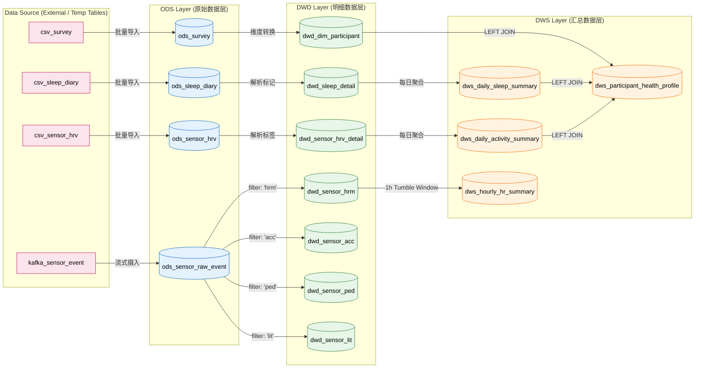

**ODS 层（原始数据层）**
1. **bhdw.ods_survey** — 参与者问卷调查表（主键：device_id）
2. **bhdw.ods_sleep_diary** — 睡眠日记表（主键：user_id, record_date）
3. **bhdw.ods_sensor_hrv** — 传感器 HRV 5分钟聚合表（主键：device_id, ts_start）
4. **bhdw.ods_sensor_raw_event** — 实时原始传感器事件宽表（主键：device_id, sensor_type, event_ts）

**DWD 层（明细数据层）**
5. **bhdw.dwd_dim_participant** — 参与者维度表，含 BMI、失眠/抑郁/焦虑等级、时型分类（主键：device_id）
6. **bhdw.dwd_sleep_detail** — 睡眠明细表，含睡眠质量和晚睡标记（主键：user_id, record_date）
7. **bhdw.dwd_sensor_hrv_detail** — HRV 传感器明细表，含活动强度和 HRV 质量标签（主键：device_id, ts_start）
8. **bhdw.dwd_sensor_hrm** — 实时心率明细表（主键：device_id, event_ts）
9. **bhdw.dwd_sensor_acc** — 实时加速度计明细表，含 magnitude（主键：device_id, event_ts）
10. **bhdw.dwd_sensor_ped** — 实时计步器明细表（主键：device_id, event_ts）
11. **bhdw.dwd_sensor_lit** — 实时光照明细表（主键：device_id, event_ts）

**DWS 层（汇总数据层）**
12. **bhdw.dws_daily_activity_summary** — 每日活动汇总表（主键：device_id, ds）
13. **bhdw.dws_daily_sleep_summary** — 每日睡眠汇总表（主键：user_id, record_date）
14. **bhdw.dws_participant_health_profile** — 参与者健康画像表（主键：device_id）
15. **bhdw.dws_hourly_hr_summary** — 实时每小时心率汇总表（主键：device_id, window_start）

此外还有 3 个 **临时表**（CSV 数据源，不持久化）：csv_survey、csv_sleep_diary、csv_sensor_hrv，以及 1 个 Kafka 临时源表 kafka_sensor_event。

总计 **15 张 Paimon 持久化表**，按批处理（prepare_batch_data.sql 含 1-3 + 5-7 + 12-14 共 12 张）和流处理（stream_job.sql 含 4 + 8-11 + 15 共 6 张，其中表 4 在流文件中创建）分布。

